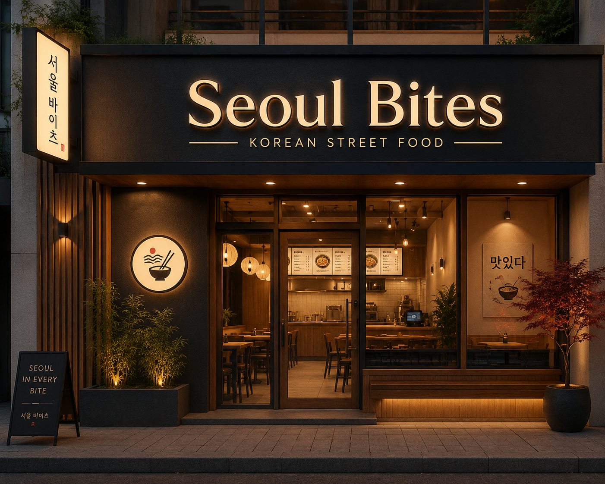

# seoul-bites
Websites inspirado na culinária coreana desenvolvido para estudos de HTML,CSS e JavaScript
Dorama-Kitchen
<!DOCTYPE html>
<html lang="pt-br">
<html>
    
<head>
    <title>SEOUL BITES</title>
  <meta name="viewport" content="width=device-width, initial-scale=1.0">

  <link rel="stylesheet" href="style.css">
</head>

<body>

<body onload="boasVindas()">  
    
<header>

    <h2> Seoul Bites</h2>

    <nav>
        <a href="index.html">Home</a>
        <a href="cardapio.html">Cardápio</a>
        <a href="galeria.html">Galeria</a>
        <a href="sobre.html">Sobre</a>
        <a href="contato.html">Contato</a>
        <a href="Comentários.html">Comentários</a>
    </nav>

</header>

<section>

<h1>Bem-Vindo ao Seoul Bites</h1>

 
Experimente pratos coreanos em um ambiente morderno e instagramavél

</section>

<h2>Horário de Funcionamento </h2>
<table border="1">
<tr>
    <th>Dia</th>
    <th>Horário</th>
</tr>

<tr>
 <td>Terça a Sexta</td>
 <td>11:00 às 19:00</td>
</tr>

<tr>
    <td>Sábado e Domingo</td>
    <td>12:00 às 21:00</td>
</tr>

</table>

 

<h2>Ambiente inspirado na Coreia do Sul</h2>

Venha experimentar!Sabores autênticos,cultura vibrante,músicas temas dos doramas e uma experiência que transporta você para a Coreia do Sul 

<h1>Faça aqui sua reserva</h1>

<form>

<label>Nome:</label>  
<input type="text" id="nome" required>    

<label>Data:</label>  
<input type="date" id="date" required>    

<label>Hórario:</label>  
<input type="time" id="horario" required>    

<label>Número de pessoas:</label>  
<input type="number" id="pessoas" min="1" required>    

<button type="button"  onclick="reservar()">Reservar</button>

</form>

    
</body>

<footer>

2026 Seoul Bites

Resende - RJ

</footer>

</html>
